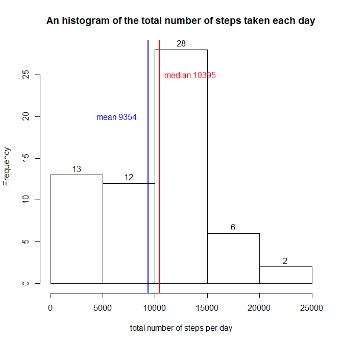
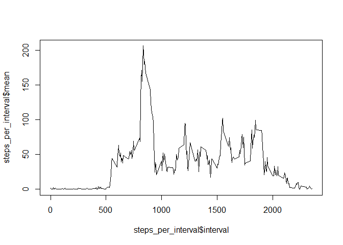
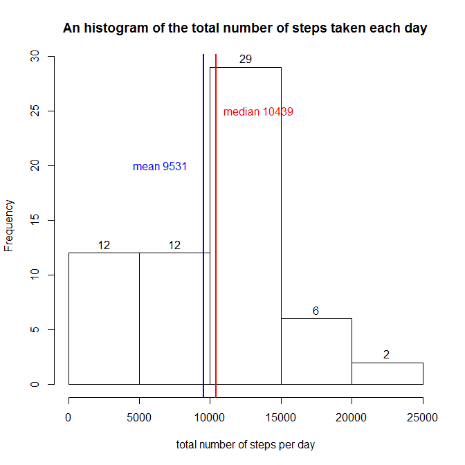
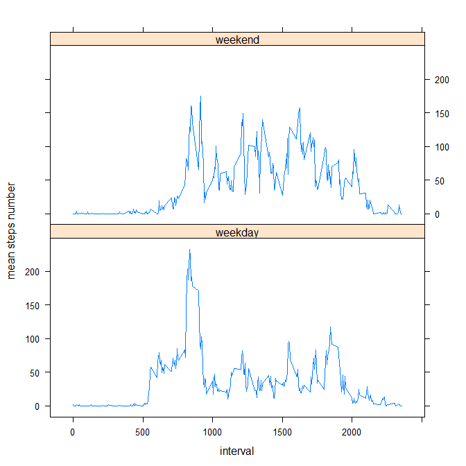

# Reproducible Research: Peer Assessment 1


## Loading and preprocessing the data


I read the (unzipped) data frame and make two transformations:

    1. the date column to R date format - new_date
    2. the intervale column to time format - new_interval

```r
data_file <- "activity.csv"
zip_file <- "activity.zip"
unzip(zipfile = zip_file)
df <- read.csv(data_file,header = TRUE)
df$new_date <- ymd(df$date)
df$new_interval <- hm(paste0(df$interval%/%100,":",df$interval%%100))
```

## What is mean total number of steps taken per day?


```r
total_steps_per_day <- ddply(df,~date,summarise,total_steps=sum(steps,na.rm = TRUE))
hist(total_steps_per_day$total_steps, xlab = "total number of steps per day",
     main = "An histogram of the total number of steps taken each day", labels = TRUE)

mean_steps <- mean(total_steps_per_day$total_steps)
abline(v = mean_steps, col = "blue", lwd = 2 )
text(mean_steps-3000, 20 , paste("mean",round(mean_steps,0)), col = "blue")

median_steps <- median(total_steps_per_day$total_steps)
abline(v = median_steps, col = "red", lwd = 2)
text(median_steps+3000, 25 , paste("median",round(median_steps,0)), col = "red")
```

 

The mean total number of steps taken per day is 9354.23

```r
mean(total_steps_per_day$total_steps)
```

```
## [1] 9354.23
```

The median total number of steps taken per day is 10395

```r
median(total_steps_per_day$total_steps)
```

```
## [1] 10395
```


## What is the average daily activity pattern?

```r
steps_per_interval <- ddply(df,~interval,summarise,mean=mean(steps,na.rm = TRUE))
plot(steps_per_interval$interval,steps_per_interval$mean, type = "l")
```

 

The 5-minute intervale which contains the maximum number of steps is 835 (on average across all the days in the dataset)

```r
max_steps <- max(steps_per_interval$mean)
max_interval <- steps_per_interval[steps_per_interval$mean == max_steps,]
max_interval$interval
```

```
## [1] 835
```


## Imputing missing values

The total number of missing values in the dataset (i.e. the total number of rows with NAs) is 2304

```r
sum(!complete.cases(df))
```

```
## [1] 2304
```


I am imputing all missing values with the mean for the 5-minute interval in all other days.
The new dataset is called df_impute

```r
df_impute = transform(df, steps = ifelse(is.na(steps), steps_per_interval[steps_per_interval$interval == interval,]$mean, steps))
```


```r
total_steps_per_day_impute <- ddply(df_impute,~date,summarise,total_steps=sum(steps,na.rm = TRUE))
hist(total_steps_per_day_impute$total_steps, xlab = "total number of steps per day",
     main = "An histogram of the total number of steps taken each day", labels = TRUE)

mean_steps <- mean(total_steps_per_day_impute$total_steps)
abline(v = mean_steps, col = "blue", lwd = 2 )
text(mean_steps-3000, 20 , paste("mean",round(mean_steps,0)), col = "blue")

median_steps <- median(total_steps_per_day_impute$total_steps)
abline(v = median_steps, col = "red", lwd = 2)
text(median_steps+3000, 25 , paste("median",round(median_steps,0)), col = "red")
```

 

The mean total number of steps taken per day is  9530.724 (before imputing was 9354.23)

```r
mean(total_steps_per_day_impute$total_steps)
```

```
## [1] 9530.724
```
The increas in percentage:

```r
(mean(total_steps_per_day_impute$total_steps) - mean(total_steps_per_day$total_steps)) / mean(total_steps_per_day$total_steps) * 100
```

```
## [1] 1.886792
```
The median total number of steps taken per day is 10439 (before imputing was 10395)

```r
median(total_steps_per_day_impute$total_steps)
```

```
## [1] 10439
```

The increas in percentage:

```r
(median(total_steps_per_day_impute$total_steps) - median(total_steps_per_day$total_steps)) / median(total_steps_per_day$total_steps) * 100
```

```
## [1] 0.4232804
```

The values show a small change. The mean and median are increased by 1,89% and 0.42% ,respectibly.  

## Are there differences in activity patterns between weekdays and weekends?
I created a new factor variable in the dataset with two levels - "weekday" and "weekend" indicating whether a given date is a weekday or weekend day (df_impute$day_type).

```r
df_impute <- transform(df_impute, day_type = ifelse(wday(df_impute$new_date) %in% c(1,7), "weekend", "weekday")) 
df_impute$day_type <- as.factor(df_impute$day_type) 
```

Here is a panel plot of the 5-minute interval (x-axis) and the average number of steps taken, averaged across all weekday days or weekend days (y-axis)

```r
avg_steps_by_interval_and_day_type <- df_impute %>% group_by(day_type, interval) %>% select(steps) %>%  summarise(avg_steps = mean (steps, na.rm = TRUE))

xyplot(avg_steps~interval | day_type,data=avg_steps_by_interval_and_day_type, type="l", layout=c(1,2), ylab = "mean steps number")
```

 

